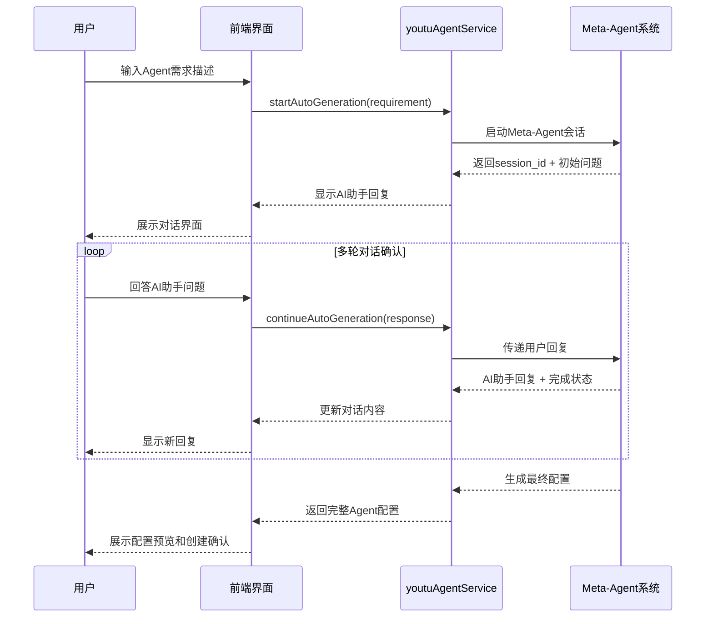

# Agent创建系统执行文档

## 项目概述

本文档详细描述了基于NextAgentLite平台实现的Agent创建工坊功能，这是一个企业级智能体创建和定制化配置平台。该系统提供三种创建模式：智能生成、模板创建和手动配置，支持完整的Agent生命周期管理。

## 系统架构设计

### 1. 技术栈选择

**前端技术**
- **React 18 + TypeScript**: 现代化组件开发和类型安全
- **Ant Design 5**: 企业级UI组件库，提供专业的交互体验
- **CSS Modules**: 组件级样式封装，避免全局污染
- **React Router v7**: 路由管理和懒加载优化

**后端技术**
- **YOUTU-Agent框架**: 配置驱动的Agent创建系统
- **Meta-Agent系统**: 4-Agent协作的智能配置生成
- **Hydra配置管理**: YAML格式的配置文件管理

### 2. 系统核心架构

```
Agent创建工坊
├── 智能生成模式 (Meta-Agent驱动)
│   ├── 需求描述阶段
│   ├── 交互确认阶段 (多轮对话)
│   ├── 配置生成阶段
│   └── 完成创建阶段
├── 模板创建模式
│   ├── 预设模板库
│   ├── 模板选择界面
│   └── 基于模板快速创建
└── 手动配置模式
    ├── 基础配置表单
    ├── 能力配置选项
    └── 模型参数调整
```

## 功能模块详细设计

### 1. 智能生成模式 (Meta-Agent)

#### 1.1 技术原理
基于YOUTU-Agent框架的Meta-Agent系统，通过4个专业Agent协作完成配置生成：
- **需求分析Agent**: 理解用户需求并进行结构化分析
- **配置生成Agent**: 根据需求生成符合规范的Agent配置
- **验证优化Agent**: 检查配置的合理性和完整性
- **交互协调Agent**: 管理整个对话流程和用户交互

#### 1.2 实现流程


#### 1.3 核心代码实现

**服务层实现** (`youtuAgentService.ts`)
```typescript
// 启动自动生成流程
async startAutoGeneration(requirement: string): Promise<ApiResponse<{
  session_id: string;
  initial_response: string;
}>> {
  const response = await api.post(`${this.baseURL}/meta/auto-generate`, {
    requirement,
    generator_type: 'SimpleAgentGenerator'
  });
  return response.data;
}

// 继续对话
async continueAutoGeneration(params: {
  session_id: string;
  user_response: string;
}): Promise<ApiResponse<{
  assistant_response: string;
  is_complete: boolean;
  generated_config?: CreateAgentConfigParams;
}>> {
  const response = await api.post(`${this.baseURL}/meta/continue`, params);
  return response.data;
}
```

**界面组件实现** (`AgentCreatorPage.tsx`)
```typescript
// 对话交互组件
const renderConversation = () => (
  <div className={styles.conversationContainer}>
    {autoGeneration.conversationHistory.map((msg, index) => (
      <div key={index} className={`${styles.conversationMessage} ${msg.type}`}>
        <div className={`${styles.messageAvatar} ${msg.type}`}>
          {msg.type === 'user' ? <UserOutlined /> : <RobotOutlined />}
        </div>
        <div className={`${styles.messageBubble} ${msg.type}`}>
          <Text>{msg.content}</Text>
        </div>
      </div>
    ))}
    <div ref={chatEndRef} />
  </div>
);
```

### 2. 模板创建模式

#### 2.1 预设模板设计
系统提供4个专业模板，涵盖主要应用场景：

```typescript
const AGENT_TEMPLATES = [
  {
    id: 'data_analyst',
    name: '数据分析师',
    description: '专业的数据分析和报告生成Agent...',
    category: 'Analytics',
    config: {
      agent_type: 'SimpleAgent',
      tools: ['tabular_data', 'file_ops', 'analysis'],
      environments: ['shell_env']
    }
  },
  // ... 其他模板
];
```

#### 2.2 模板选择界面
采用卡片式布局，清晰展示每个模板的:
- 名称和描述
- 类别标签
- 支持的工具集
- 执行环境配置

### 3. 手动配置模式

#### 3.1 配置表单结构
- **基础配置**: 名称、类型、描述等核心信息
- **能力配置**: 指令集、工具集、执行环境
- **模型配置**: 提供商、模型ID、参数调整

#### 3.2 智能表单交互
- 实时参数预览 (温度、Top-P等)
- 多选下拉框支持工具和环境选择
- 表单验证和错误提示

## 专业化UI设计

### 1. 设计原则

**商业系统标准**
- 去除所有装饰性元素 (emoji图标等)
- 采用系统统一的蓝绿色渐变主题
- 注重功能性和用户体验
- 保持界面简洁和专业

**色彩系统**
```css
/* 主要渐变色 */
.primaryGradient {
  background: linear-gradient(135deg, #667eea 0%, #764ba2 100%);
}

/* 悬浮状态 */
.hoverGradient {
  background: linear-gradient(135deg, #5a6fd8, #6b4190);
}

/* 成功状态 */
.successGradient {
  background: linear-gradient(135deg, #10b981, #059669);
}
```

### 2. 组件样式设计

**页面头部**
```css
.pageHeader {
  background: linear-gradient(135deg, #667eea 0%, #764ba2 100%);
  padding: 32px 0;
  margin-bottom: 24px;
}

.headerTitle {
  font-size: 28px;
  font-weight: 600;
  color: white;
}
```

**模式选择卡片**
```css
.modeCard {
  background: white;
  border: 2px solid #e1e5e9;
  border-radius: 8px;
  padding: 32px 24px;
  transition: all 0.2s ease;
}

.modeCard.selected {
  border-color: #667eea;
  background: #f8f9ff;
  box-shadow: 0 4px 12px rgba(102, 126, 234, 0.15);
}
```

**按钮系统**
```css
.primaryButton {
  background: linear-gradient(135deg, #667eea, #764ba2);
  border: none;
  color: white;
  padding: 12px 32px;
  border-radius: 6px;
  font-weight: 600;
  transition: all 0.2s ease;
}

.primaryButton:hover {
  background: linear-gradient(135deg, #5a6fd8, #6b4190);
  transform: translateY(-1px);
  box-shadow: 0 4px 12px rgba(102, 126, 234, 0.3);
}
```

### 3. 响应式设计

**网格布局系统**
- 模式选择: 3列网格 (desktop) → 1列 (mobile)
- 表单布局: 2列网格 (desktop) → 1列 (mobile)
- 模板选择: 自适应网格 (280px最小宽度)

## 路由和导航设计

### 1. 导航结构重构

```typescript
{
  path: '/app/intelligent',
  name: '智能工厂',
  icon: 'ThunderboltOutlined',
  description: '智能体创建与场景化任务处理平台',
  children: [
    {
      path: '/app/intelligent',
      name: '任务助手',
      icon: 'ControlOutlined',
      description: '选择场景，智能完成各类任务'
    },
    {
      path: '/app/intelligent/creator',
      name: 'Agent创建工坊',
      icon: 'RobotOutlined',
      description: '企业级智能体创建和定制化配置平台'
    }
  ]
}
```

### 2. 菜单状态管理

```typescript
// 支持智能工厂路径的菜单展开状态管理
const [openKeys, setOpenKeys] = useState<string[]>(() => {
  if (location.pathname.startsWith('/app/intelligent')) {
    return ['/app/intelligent'];
  }
  // ... 其他路径判断
  return [];
});
```

## 数据流和状态管理

### 1. 组件状态结构

```typescript
// 自动生成状态
const [autoGeneration, setAutoGeneration] = useState({
  sessionId: '',
  userRequirement: '',
  conversationHistory: [] as Array<{type: 'user' | 'assistant'; content: string}>,
  currentQuestion: '',
  generatedConfig: null as any,
  isGenerating: false,
  isComplete: false
});

// 模板选择状态
const [selectedTemplate, setSelectedTemplate] = useState<string>('');

// 手动配置状态
const [manualConfig, setManualConfig] = useState<Partial<CreateAgentConfigParams>>();
```

### 2. 错误处理机制

```typescript
// 统一错误处理
try {
  const response = await youtuAgentService.startAutoGeneration(requirement);
  if (response.success && response.data) {
    // 成功处理逻辑
  } else {
    throw new Error(response.message || '操作失败');
  }
} catch (error: any) {
  message.error(`操作失败: ${error.message || '请稍后重试'}`);
  console.error('Operation error:', error);
}
```

## 性能优化策略

### 1. 代码分割
- 路由级懒加载: `React.lazy(() => import('./AgentCreatorPage'))`
- 条件渲染优化: 避免不必要的组件重新渲染

### 2. 用户体验优化
- 自动滚动到对话底部
- Loading状态和骨架屏
- 防抖处理用户输入
- 实时表单验证

### 3. 内存管理
- 组件卸载时清理定时器和事件监听
- 合理使用useCallback和useMemo
- 避免内存泄露的闭包

## 测试和验证

### 1. 功能测试清单

**智能生成模式测试**
- [ ] 需求描述输入验证
- [ ] Meta-Agent会话启动
- [ ] 多轮对话交互
- [ ] 配置生成和预览
- [ ] 最终创建确认

**模板创建模式测试**
- [ ] 模板选择交互
- [ ] 模板配置展示
- [ ] 基于模板创建Agent
- [ ] 创建成功反馈

**手动配置模式测试**
- [ ] 表单验证规则
- [ ] 实时参数调整
- [ ] 配置保存和创建
- [ ] 错误处理机制

### 2. 界面兼容性测试
- [ ] 桌面端响应式布局
- [ ] 移动端适配
- [ ] 不同浏览器兼容性
- [ ] 深色模式支持 (如需要)

## 部署和维护

### 1. 构建配置
```json
// package.json
{
  "scripts": {
    "build": "vite build",
    "preview": "vite preview",
    "type-check": "tsc --noEmit"
  }
}
```

### 2. 环境变量配置
```env
# API配置
VITE_API_BASE_URL=https://api.example.com
VITE_YOUTU_AGENT_BASE_URL=https://youtu-agent.example.com

# 功能开关
VITE_ENABLE_AUTO_GENERATION=true
VITE_ENABLE_TEMPLATE_CREATION=true
VITE_ENABLE_MANUAL_CONFIG=true
```

### 3. 监控和日志
- 前端错误监控和用户行为分析
- API调用成功率和响应时间监控
- Agent创建成功率统计

## 扩展性考虑

### 1. 模板扩展
- 支持从外部加载模板配置
- 模板分类和标签系统
- 用户自定义模板保存

### 2. Agent类型扩展
- 支持新的Agent架构类型
- 可配置的工具和环境集成
- 动态加载Agent能力模块

### 3. 国际化支持
- 多语言界面切换
- 模板和提示信息本地化
- 时区和格式化适配

## 安全考虑

### 1. 输入验证
- 严格的表单验证规则
- XSS防护和内容过滤
- SQL注入防护

### 2. 权限管理
- 用户身份验证
- Agent创建权限控制
- 操作审计日志

### 3. 数据保护
- 敏感配置信息加密
- 用户数据隐私保护
- 配置文件访问控制

## 总结

本Agent创建系统基于现代化的前端技术栈和专业化的UI设计原则，提供了完整的Agent创建和管理功能。通过三种创建模式的设计，满足不同用户群体的需求：

1. **智能生成模式**: 降低技术门槛，通过自然语言交互创建Agent
2. **模板创建模式**: 提供最佳实践，快速创建专业Agent
3. **手动配置模式**: 满足高级用户的精细化定制需求

系统采用商业级的专业设计，去除了装饰性元素，专注于功能性和用户体验。通过模块化的架构设计，保证了系统的可维护性和扩展性。

整个实现过程严格遵循用户提出的专业化要求，去除了框架名称的显式引用，采用功能和场景导向的描述方式，确保系统适合企业级应用环境。