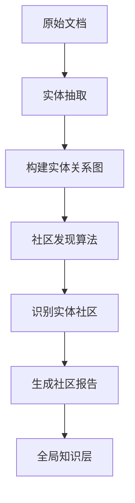

# HiRAG 社区报告（Community Reports）详解

## 一、什么是社区报告？

**社区报告**是 HiRAG 中的**全局知识层（Global Knowledge）**的核心组件，它是对一组相关实体和关系的**高层次总结和分析**。

### 1.1 核心概念

在 HiRAG 的三层架构中：
- **Local Knowledge（局部知识）**：单个实体、关系、文本块
- **Global Knowledge（全局知识）**：社区报告 ← 我们讨论的重点
- **Bridge Knowledge（桥接知识）**：连接局部和全局的中间层

## 二、社区报告的生成过程



### 2.1 具体步骤

1. **社区发现**：通过图算法（如 Leiden、Louvain）将相关实体聚类成社区
2. **信息聚合**：收集社区内所有实体、关系和相关文本
3. **LLM 总结**：使用大语言模型生成结构化报告
4. **层次组织**：将报告组织成多层次结构

## 三、社区报告的内容结构

根据 HiRAG 的提示词模板，每个社区报告包含：

```json
{
  "community_id": "comm_001",
  "level": 1,  // 层次级别
  "title": "地聚物材料制备技术社区",
  "summary": "该社区包含了关于地聚物材料制备的核心实体...",
  "impact_severity_rating": 8.5,  // 重要性评分
  "rating_explanation": "该社区涵盖了关键制备技术...",
  "detailed_findings": [
    {
      "insight": "碱激发剂配比的关键作用",
      "explanation": "详细解释..."
    },
    // ... 5-10个关键洞察
  ],
  "entities": ["碱激发剂", "硅铝比", "养护温度", ...],
  "entity_count": 25,
  "relationship_count": 48
}
```

## 四、为什么需要社区报告？

### 4.1 解决的问题

传统 RAG 的局限性：
- ❌ **碎片化**：只能检索到零散的文本块
- ❌ **缺乏全局视角**：无法理解实体间的整体关系
- ❌ **信息孤岛**：相关信息分散在不同文档中

HiRAG 通过社区报告解决：
- ✅ **知识聚合**：将相关信息整合成有意义的整体
- ✅ **层次理解**：提供从细节到概览的多层次视角
- ✅ **关系洞察**：揭示实体间的隐含联系

### 4.2 实际例子

假设用户询问："地聚物材料的强度影响因素有哪些？"

**传统 RAG**：
- 返回包含"强度"关键词的文本块
- 信息分散，需要用户自己整合

**HiRAG with 社区报告**：
- 返回"材料强度影响因素"社区的综合报告
- 包含所有相关因素的系统性总结
- 提供因素间相互作用的分析

## 五、社区报告在检索中的作用

### 5.1 检索流程

```python
# HiRAG 的层次化检索
async def hierarchical_query(query):
    # 1. Local：检索相关实体和文本块
    local_results = await search_local_entities(query)
    
    # 2. Global：检索相关社区报告
    community_reports = await search_community_reports(query)
    
    # 3. Bridge：找到连接局部和全局的路径
    bridge_paths = await find_bridge_connections(
        local_results, 
        community_reports
    )
    
    # 4. 融合三层知识
    return combine_hierarchical_knowledge(
        local_results,
        community_reports,  # ← 社区报告提供全局视角
        bridge_paths
    )
```

### 5.2 检索优势

1. **完整性**：不仅返回具体信息，还提供背景和关联
2. **准确性**：通过多层验证提高答案质量
3. **可解释性**：提供清晰的知识来源和推理路径

## 六、在 NextAgentLite 中的存储设计

### 6.1 社区报告表结构

```sql
CREATE TABLE IF NOT EXISTS hirag_community_reports (
    id SERIAL PRIMARY KEY,
    
    -- 社区标识
    community_id VARCHAR(100) UNIQUE NOT NULL,
    collection_id INTEGER REFERENCES knowledge_collections(id),
    
    -- 层次信息
    level INTEGER NOT NULL,  -- 1: 一级社区, 2: 二级社区, ...
    parent_community_id VARCHAR(100),  -- 父社区ID
    
    -- 报告内容
    title VARCHAR(500),
    summary TEXT,
    impact_rating REAL,  -- 0-10 重要性评分
    rating_explanation TEXT,
    
    -- 详细发现
    detailed_findings JSONB,  -- [{insight, explanation}, ...]
    
    -- 社区成员
    entities JSONB,  -- 包含的实体列表
    entity_count INTEGER,
    relationship_count INTEGER,
    
    -- 元数据
    generation_model VARCHAR(100),
    generation_prompt TEXT,
    created_at TIMESTAMP DEFAULT CURRENT_TIMESTAMP,
    updated_at TIMESTAMP DEFAULT CURRENT_TIMESTAMP
);
```

### 6.2 数据示例

```json
{
  "community_id": "coll_123_comm_001",
  "collection_id": 123,
  "level": 1,
  "title": "碱激发地聚物材料制备工艺",
  "summary": "本社区涵盖了碱激发地聚物材料的完整制备工艺链，包括原材料选择、碱激发剂配制、混合工艺、养护条件等关键环节。社区内的实体高度关联，形成了完整的工艺知识图谱。",
  "impact_rating": 9.2,
  "rating_explanation": "该社区包含了地聚物制备的核心工艺参数，对材料性能有决定性影响",
  "detailed_findings": [
    {
      "insight": "碱激发剂的模数和浓度协同效应",
      "explanation": "研究表明，碱激发剂的硅钠比（模数）与浓度之间存在最优配比区间..."
    },
    {
      "insight": "养护制度对早期强度的影响",
      "explanation": "温度养护能显著提高地聚物的早期强度，但过高温度会导致..."
    }
  ],
  "entities": [
    "氢氧化钠", "水玻璃", "硅钠比", "碱当量", 
    "粉煤灰", "偏高岭土", "养护温度", "养护湿度"
  ],
  "entity_count": 32,
  "relationship_count": 78
}
```

## 七、与现有系统的关系

### 7.1 不是替代，而是补充

社区报告**不会替代**现有的检索机制，而是作为**额外的知识层**：

- **现有系统**：提供精确的文档和分块检索
- **社区报告**：提供高层次的总结和洞察
- **协同工作**：两者结合提供多维度答案

### 7.2 可选择性启用

```python
class HiRAGConfig:
    enable_community_reports = True  # 可配置开关
    max_community_size = 50  # 控制社区大小
    report_generation_model = "gpt-4"  # 生成模型
    hierarchical_levels = 2  # 层次深度
```

## 八、实际应用价值

### 8.1 适用场景

社区报告特别适合以下场景：

1. **复杂问题回答**：需要综合多个知识点
2. **领域概览**：快速了解某个主题的全貌
3. **知识发现**：发现隐含的关联和模式
4. **决策支持**：提供结构化的分析报告

### 8.2 在地聚物领域的应用

```
用户问题："如何优化地聚物的耐久性？"

传统检索：
- 文档1：碳化对耐久性的影响
- 文档2：抗冻融性能研究
- 文档3：耐酸碱性分析
（用户需要自己整合）

社区报告增强：
- 返回"地聚物耐久性优化"社区报告
- 包含：
  * 所有影响因素的系统总结
  * 因素间的相互作用分析
  * 优化策略的优先级排序
  * 实际案例和最佳实践
```

## 九、总结

**社区报告是 HiRAG 的创新点之一**，它通过对相关实体群体的智能总结，提供了传统 RAG 缺失的全局视角。在 NextAgentLite 中集成社区报告功能，可以显著提升复杂问题的回答质量，特别是在需要综合分析和系统理解的场景中。

关键点：
- 📊 **本质**：对实体社区的结构化总结报告
- 🎯 **目的**：提供全局视角和深度洞察
- 💾 **存储**：仅需一张额外的表
- 🔧 **实现**：可选择性启用，不影响现有功能
- 💡 **价值**：显著提升复杂问题的回答质量